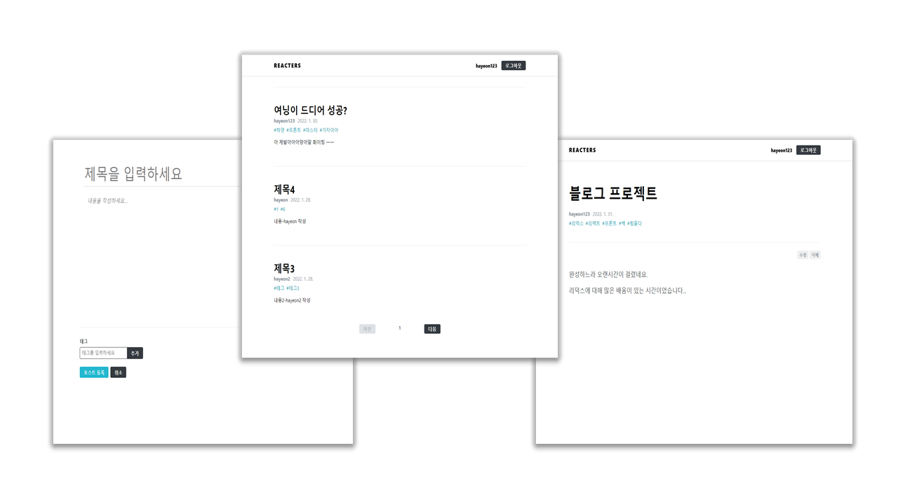

# Blog Project (REACTERS)

### 기능 설명

* JWT를 이용한 회원 인증 서비스 구현 (로그인 / 회원가입)
* redux-saga와 RESTAPI, MongoDB를 이용한 글쓰기, 포스트 조회/수정/삭제 서비스 구현

### 기술 설명

* Front-end : React, JS, Redux, Redux-Middleware, Hooks, styled-components, Axios
* Back-end : Node.js, REST API, MongoDB, JWT
* 추가 사용 라이브러리 : immer, qs, quill, react-helmet-async, bcrypt, joi, koa, sanitize-html, eslint

